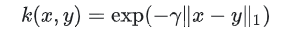

# About the geolocation data clustering
it s a light weight API to apply clustering on geolocation data   

version = 1.0 

## Requirements
- Python 3
- numpy 
- matplotib 
- pandas
- sklearn


## Usage 
it is a command line API :

```
python main.py args 
```

arguments : 
* ```--path``` : the path to geolocation_data JSON dataset  , **default = "data/Brisbane_CityBike.json"**
* ```--clustering``` :  specifies the clustering model 
  * if None just plot simple the data else it takes only 3 values ( kmeans | spectral | agglo )
  * agglo stands for agglomerative clustering
  * **default = None**
                        
* ```--n_clusters``` : the number of clusters , **default = 2**
* ```--plot_type``` : 
  * 3 clustering plots type("scatter"|"regions"|"distances" )
  * spectral and agglomerative clustering are models  where we cannot retrieve the cluster membership of new data and have no centroids by definition , thus we could only use the first type which is scatter  
  * **default = 'scatter'**
                      
- ```--random_seed``` : for reproducibility , **default = 0**
- ```--save ``` : a boolean to determine if you want to save the figure on "outputs" directory , **default = True**
- ```--map_path``` : the path to background image map file , **default = "images/map.png"** 
- ```--map_transparency``` : float in range (0,1) , to determine the transparency ,  **default=0.4**
- ```--map_name``` : tha name of the map appearing on the figures title  , for instance the name of a city  ,  **default='Brisbane'**


the following is a non-exhaustive list of some commands examples :

```
python main.py

python main.py  --clustering="kmeans"   --n_clusters=2 
python main.py  --clustering="kmeans"   --n_clusters=4  --plot_type="regions"
python main.py  --clustering="kmeans"   --n_clusters=5  --plot_type="distances"

python main.py  --clustering="spectral"  --save=False  --map_transparency=0.9

```


## Notes :
- the argument values have to be passed only within double quotes , it doesn't work with single quotes
- for help , execute the command : 
```
python main.py -h
```

## experiments on geolocation Brisbane(Australia) bike‘s stations data 

Our data after preprocessing :
<p align="center"></p>
We could intuitively see that our data is splitted into 2 groups 
so our experiments will be focused more on **n_clusters=2**

I've chosen the following models because I have a deep theoretical / practical understanding of them , I've tried many experiences and other models that I understand such as 'Gaussian Mixtures' and it has bad results . So , I've selected the most relevant ones :

1) **Kmeans** : 
<p align="center"></p>
optimizing MSE on all possible centroids is NP-Hard 
<p align="center"></p>

Thus  ,  K-means follows a greedy approach which does pretty well , however in this problem we could realize intuitively that he is falling in a local minimum which is pretty well 
and not that bad 

2) **Spectral** ( with laplacian kernel ) :
<p align="center"></p>

Affinity matrix used for spectral clustering will use Laplacian kernel in our case , the following figure shows laplacian distribution :
<p align="center"></p>
<p align="center"></p>


3) **Agglomerative** ( with maximum linkage ) :
<p align="center"></p>

taking the max distance at each time between two sets is relevant because as we can see , outlayers ( extreme points ) will play an important role to keep the merging smooth and realistic for this dataset


**other plots** : 

- Kmeans , K = 5 : 

<p align="center"></p>

- Kmeans , K = 4 : 

<p align="center"></p>


## Further Improvements : 
- extend datatypes : JSON , CSV , ...
- extend the list of argments especially for clustering models parameters  
- include shorcut arguments and single quotes argument values  , for Ex : -p for --path 
- propose more visualizations for clustering


## License
November , 2019

[MIT license](http://opensource.org/licenses/MIT).
